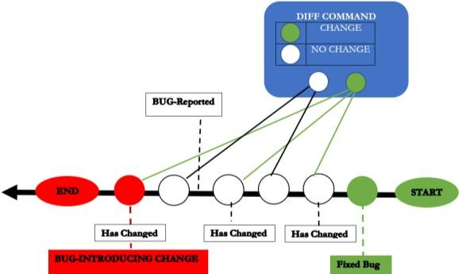

> ***Acknowledgements***
>
> ***Professor Barbara Russo has been the ideal supervisor. Her sage
> advice, insightful criticisms, and patient encouragement aided the
> writing of this paper in innumerable ways***
>
> ***- Heider Jeffer***

<table>
<colgroup>
<col style="width: 49%" />
<col style="width: 50%" />
</colgroup>
<thead>
<tr>
<th>
<strong>Developer</strong>

Heider Jeffer

Fakultät für Informatik Freie Universität Bozen <a
href="mailto:Hjeffer@unibz.it"><u>Hjeffer@unibz.it</u></a>
</th>
<th><blockquote>

<strong>Supervisor</strong>

Professor Barbara Russo Fakultät für Informatik

Freie Universität Bozen <a
href="mailto:Barbara.Russo@unibz.it"><u>Barbara.Russo@unibz.it</u></a>

</blockquote></th>
</tr>
</thead>
<tbody>
</tbody>
</table>

> **Document Status: \[processed\] 2018 November 26th**

# ABSTRACT

> software bug is an error, flaw, failure or fault in a computer program
> or system that causes it to produce an incorrect or unexpected result,
> or to behave in unintended ways. The term "bug" to describe defects
> has been a part of engineering jargon since the 1870s
>
> and predates electronic computers and computer software; it may have
> originally been used in hardware engineering to describe mechanical
> malfunctions. For instance, Thomas Edison wrote the following words in
> a letter to an associate in 1878: \[It has been just so in all of my
> inventions. The first step is an intuition, and
>
> comes with a burst, then difficulties arise—this thing gives out and
> \[it is\] then that "Bugs"\]. **When Was Bug Introduced & Who Was
> Responsible?** Why do we think that the questions of this project are
> worth to ask? “Some software bugs have been linked to disasters. Bugs
> in code that controlled the Therac-25 radiation therapy machine were
> directly responsible for patient deaths in the 1980s. In 1996, the
> European Space Agency's US\$1 billion prototype Ariane 5 rocket had to
> be destroyed less than a minute after launch due to a bug in the
> on-board guidance computer program. In June 1994, a Royal Air Force
> Chinook helicopter crashed into the Mull of Kintyre, killing 29. This
> was initially dismissed as pilot error, but an investigation by
> Computer Weekly convinced a House of Lords inquiry that it may have
> been caused by a software bug in the aircraft's engine-control
> computer \[Barbara Russo\].”
>
> In this research we will introduce the SZZ algorithm as a feasible
> solution for the bug problem. We also use media player to represent
> our research problem, solution and formula that we used in this paper.
>
> SZZ algorithm provides a process for automatically identifying the
> fix-inducing predecessor lines to lines that are changed in a
> bug-fixing commit. SZZ algorithm provides a processes for
> automatically identifying the fix-inducing predecessor lines to lines
> that are changed in a bug-fixing-commit. For this analysis we need to
> know all the changes and all fixes of project. We get this data from
> version archive like CVS and bug tracking systems like BUGZILLA. As a
> result. We will successfully answer the research questions; when bug
> was introduced & who was responsible. Finally. The SZZ algorithm still
> not perfect but better than anything existing so far and therefore 0ur
> future work is looking forward to make more progressive to improve the
> SZZ algorithm in term of precise and accuracy.
>
> In this research we introduced our solution for the research question
> by written solution with media graphic form. We believe that our media
> graphic form will make our research easy to understand by the decision
> makers of the software industries or the shareholder, our media
> graphic form will explain all our complex implementations in a simple
> way.

# MODELS & DEFINITIONS

1.  Model(01): Define Life Cycle of Bug.

2.  Model(02): Define SZZ algorithm.

3.  Definition(01): Define the Fixed Bug & BUG- Reported and find the
    link between them.

4.  Definition(02): Define BUG-INTRODUCING CHANGE.

5.  Definition(03): Define SZZ tools--DIFF command with an example from
    Prof. Barbara Java source code.

6.  Definition(04): Syn: Syntactic Analysis

7.  Definition(05): Sem: Semantic Analysis

8.  Model Output: ECLIPSE & MOZILLA

9.  Output analysis: Similarity and dissimilarities between Eclipse and
    Mozilla.

# MODEL

> For this project, we design two models: Model 1which represent life
> cycle of bugs & Model 2 which represent the SZZ algorithm.

# MODEL 1-LIFE CYCLE OF BUG

> Model 1 represent the definition of the life cycle of the bug:

1.  Start—Model 1

2.  \[Bug-Introducing Changes\].

3.  Bug Report.

4.  \[Fixed Bug\].

5.  End—\[Model 1\]

> *Figure 1 LIFE CYCLE OF BUG by Heider Jeffer*

# MODEL 2 SZZ ALGORITHM

> Model 2 is the definition for the SZZ algorithm. Model 2 will start
> when the Model 1 is End.

1.  Start–\[Model 2\] from the End—\[Model 1\]

2.  Fixed Bug

3.  DIFF Command— \[Track & Located the Changes\]

4.  BUG-Reported

5.  Remove False Changes

6.  BUG-INTRODUCING CHANGE— \[Changes

> that occur before the report\].

7.  End — Model 2

>  style="width:3in;height:1.6875in" />
>
> *Figure 2 SZZ ALGORITHM by Heider Jeffer*
>
> *“In this project we assume that the changes between Fixed Bug and
> Bug-Reported is the False Changes, therefore we remove it.”*

# DEFINITION1: FIXED BUG & BUG REPORTED

> The FIXED BUG and BUG REPORTED are two information that we know. In
> this project we want to find the link (relation) between these two
> information (FIXED BUG & BUG REPORTED) by the following:

1.  Start with BUG REPORTED

2.  Move Backward.

3.  Track change with Diff command

4.  Check each revision in term of which revision that includes change.

5.  Remove every revision that have no change.

6.  Continue until we arrive to the BUG REPORTED.

> The link (relation) between FIXED BUG and BUG REPORTED is a sequence
> of revisions that had been changed.

# FOR A SHORTCUT WHY WE DON’T SZZ START IMIDIATLY FROM BUG REPORTED?

> SZZ can’t start immediately from Bug Reported because the Bug Reported
> is not define. SZZ must start from FIXED BUG even if the revision
> changes no matter after Bug reported because the revisions with no
> changes are highly recommended to define the Start of SZZ algorithm or
> any algorithm that solve the tracking / locating problem(e.g. Big M
> algorithm non B.V.).

# DEFINITION 2: REMOVE FALSE CHANGES

> BUG-INTRODUCING CHANGE is the revision
>
> include change before BUG REPORTED. Since we identify the link
> (relation) between FIXED BUG and BUG REPORTED, now we can identify
> (solve) the BUG-INTRODUCING CHANGE problem.
>
>  style="width:3in;height:1.685in" />*Figure 3 BUG-INTRODUCING CHANGE &
> REMOVE FALSE*
>
> *CHANGES by Heider Jeffer*
>
> In our project we will start from BUG REPORTED and moving backward.
> Our algorithm will ignore the revisions that not include changed. The
> algorithm will keep moving backward to check each revisions one by one
> if the revision include no change then the algorithm will be ignore it
> and it will check the next revision, until the algorithm identify the
> revision that include change, this revision is the BUG- INTRODUCING
> CHANGE.

> False Changes are the changes between Fixed Bug and Bug Reported. We
> will remove all false changes.

# DEFINITION 3: SZZ TOOL

> DIFF command is a tool that calculates and displays the differences
> between two revisions and the output is the colored lines represent
> the change between these two revisions these changes could be the line
> that added, line deleted, line moved, or the line changed by the
> developers, the DIFF will display the differences in the revisions by
> comparing the revisions line by line before and after the developer
> added, line deleted, line moved, or changed a line (e.g Heider Jeffer
> Gitlab – WP project with Prof. Barbara Russo).
>
>  style="width:2.96181in;height:1.59in" />*Figure 4 DIFF command*
>
> In this project we used the DIFF command to:
>
> Find the link (relation) between fixed bug and bug reported. To
> identify the revision that BUG- INTRODUCING CHANGE.

> *Figure 5 SZZ with DIFF command by Heider Jeffer*

# WHY BEFORE BUG REPORT NOT AFTER?

> Bug introduced before report because of bug cycle
>
> life; First bug introduced, reported , then fixed (figure 5).

# DIFF COMMAND

> DIFF command used the colors (e.g. Green, Red, Purple, Blue and
> Yellow) each color represent the type of the lines differences between
> two revisions as the following:

#  APPLICATION DIFF COMMAND

> In our project with Prof. Barbara we make an experiment. We open a
> source code and we run a diff command on it to determine what changed
> in the bug- fixes. The SZZ assumes that deleted or modified source
> code in each (Red or Green - Colors) is the location of a bug.

> *Figure 6 Prof. Barbara Source Code with DIFF command by Heider
> Jeffer*

# SYNTACTIC ANALYSIS

> The syntactic confidence is an integer number between 0-2. The
> syntactic confidence Syn analysis for our project have three different
> type of conditions (A,B,&C). Letter A has a value of zero the rest
> letters (B & C) they have value of 1 (if they satisfied the conditions
> criteria that we set for each of them). We initially assign a
> syntactic confidence syn of zero then we raise the confidence by one:

# EXAMPLE

> Syn Level of Confidence:

- If we have all letters (A,B &C) then A+B+C = 0+1+1 = 2 level of
  confidence.

- If we have B or C, then syn = 1 level of

> confidence.

| **DIFF Color** | **Meaning**      |
|----------------|------------------|
| **Green**      | Line Added       |
| **Red**        | Line Deleted     |
| **Purple**     | Line Changed     |
| **Blue**       | Change Highlight |
| **Yellow**     | Line Changed     |

- If we have letter A then syn = 0 level of confidence…etc.

# SEMANTIC ANALYSIS

> The semantic Sem analysis for our project have five conditions
> A,B,C,D, and E.The semantic Sem analysis for our project have five
> different type of conditions (A,B,C,D,&E). Letter A has a value of
> zero the rest letters (B,C,D,&E) they have value of 1 (if they
> satisfied the conditions criteria that we set for each one of them).
> Thus For each (A,B,C, & D) letters we have assigned the link as a
> semantic level of the confidence based on the following conditions:

# EXAMPLE

> Sem Level of Confidence:

- If we have all letters A+B+C+D+E = 0+1+1+1+1= 4 level of confidence.

- If we have 3 over 5 letters and one of these letters is A then the sem
  = 2 level of confidence.

- If we have 3 over 5 letters and if letter A is not one of them then
  sem = 3 level of confidence…etc.

# SYN/SEM: ECLIPSE

> After we have the syntactic and semantic confidence level, now, we can
> distribute the links across these two confidence levels.

> *Figure 7 Distribution of links accross different classes of syntactic
> and semantic confidence levels in ECLIPSE from Jacek S´liwersk*
>
> By using the following formula on Figure 7, we decided to use only
> those links whose syntactic and
>
> semantic levels of confidence satisfy the following condition:
>
> sem \> 1 ∨ (sem = 1 ∧ syn \> 0) … a
>
> And by implement Form. (a) on Figure 8: Distribution of links across
> different classes of syntactic and semantic confidence levels in
> ECLIPSE We will have the following output:

> *Figure 9 sem \> 1 ∨ (sem = 1 ∧ syn \> 0)*
>
> We identified 25,317 links for ECLIPSE, connecting 47% of fixed bugs
> with 29% of transactions.
>
> We used video editor to display the flow of Form (a).

# CONCLUSION

> The SZZ algorithm even if it is good but it is not enough to solve the
> bug problem because there are many factors interact with bug problem
> that we have to put them in our consideration one of these factor is
> the developer as we see the gap between Mozilla and Eclipse in our
> syn/sem analysis. The more the developer is professional and expert
> the better to detect, locate, track and fix the bug .
>
> *THE ANSWER FOR OUR RESEARCH QUESTION*
>
> *Here our paper give the answer for our research question When the was
> Bug Introduced & The Man Who Was Responsible for it. Thus had been
> determined by SZZ algorithm.*
>
> Our solution provide the decision maker in software organization an
> automatic tracking for bug introduced changed, this mean by using SZZ
> algorithm you will minimize the cost of time and maximize your
> software quality which is a paradigm shift toward reliable product in
> term of eliminating error sooner no later, and this solution give the
> answer to the major companies and software industries that daily faced
> the software errors (bug)
>
>  style="width:3in;height:1.6875in" />

- When was bug introduced? The bug was interduce in the revision before
  the bug has been reported – \[by SZZ\]. And,

- Who was responsible? The developer of the first revision that had been
  changed before the bug had been reported is responsible for Bug
  Introducing Changes – \[by SZZ\].

- Bug can only appear before the report – \[Bug Introducing Changed\].

- Not all changes are fixes – \[False Changes\].

- Annotate information is insufficient – \[Before the report change is
  matter\].

# REFERENCES

- J. S´liwerski, When Do Changes Induce Fixes?
  [<u>https://goo.gl/QZxMMz</u>](https://goo.gl/QZxMMz)

- N. Bettenburg, Automatic Identification of Bug Introducing Changes.
  [<u>https://goo.gl/Vt9f2G</u>](https://goo.gl/Vt9f2G)

- T. Zimmermann, Automatic Identification of Bug-Introducing Changes
  [<u>https://goo.gl/pNHR31</u>](https://goo.gl/pNHR31)

>  style="width:5.61087in;height:2.9975in" />
>
> *Figure 1 from Prof Barbara Russo Slide*
